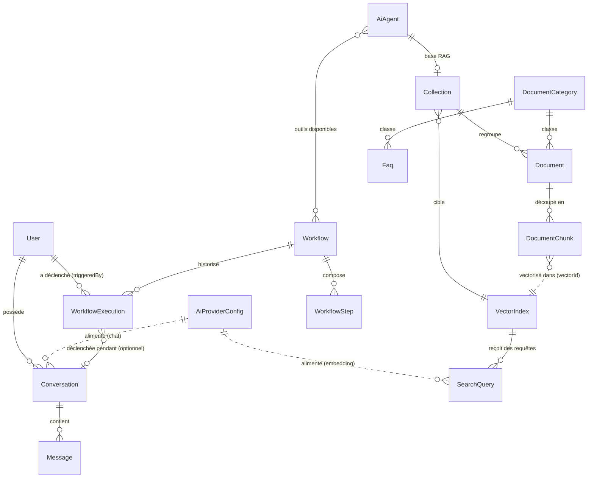

# Backoffice admin (`/admin`) — guide des pages

Le backoffice est un CRUD Sylius (Resource/Grid Bundle) au-dessus des entités Doctrine, exposé
en plus de l'API REST (API Platform). Les routes sont déclarées dans
[`backend/config/routes/admin.yaml`](../../backend/config/routes/admin.yaml), les grilles dans
`backend/src/Grid/`, les entités dans `backend/src/Entity/`. Le menu de la sidebar est construit
dynamiquement par `nav()` dans
[`backend/src/Twig/AdminExtension.php`](../../backend/src/Twig/AdminExtension.php) : il ne
liste que 6 groupes fixes et filtre les entrées dont la route n'est pas enregistrée — toute
route admin qui n'apparaît pas dans un de ces groupes reste accessible mais **invisible dans le
menu**.

## Pages listées dans le menu

### Chatbot Admin (accueil)
`DashboardController` (route `app_admin_dashboard`, `/admin/`). Simple point d'entrée, rend
`templates/admin/dashboard.html.twig` — pas de modèle de données propre.

### Analytics

- **Vue d'ensemble** (`AnalyticsController`, route `app_admin_analytics_index`, `/admin/analytics`)
  — pas une ressource Sylius (rien à créer/modifier/supprimer, lecture seule). Agrège des
  données qui existaient déjà mais n'avaient pas de vue exploitable :
  conversations (total/actives), messages (total, par rôle), tokens consommés (somme de
  `Message.metadata.token_usage.total_tokens` sur les réponses assistant), feedback 👍👎
  (`Message.feedback`), et recherches vectorielles (total, durée moyenne, nombre de résultats
  moyen, 10 plus récentes). Calculé par `App\Chat\AnalyticsService::getDashboardStats()`
  (requêtes DQL `COUNT`/`AVG`/`GROUP BY` ; le total de tokens est sommé en PHP après lecture des
  `metadata` JSON, pas en SQL — voir la recherche hybride ci-dessous pour le même choix côté
  `document_chunk.content`). Pas de test automatisé dédié (agrégats DQL contre de vraies entités
  — même limite que les autres services testés uniquement via de vraies dépendances `final`,
  voir `docs/BACKLOG.md`) ; vérifié manuellement via `curl` (session `/admin/login` +
  cookie) contre les données réelles de l'instance de dev.

### IA & Vecteurs

- **Providers IA** (`AiProviderConfig`) — connecteurs vers les LLM/embeddings (Ollama ou
  endpoint API générique). Champs clés : `name` (unique), `usage` (`chat`/`embedding`),
  `provider` (`ollama`/`api_endpoint`), `apiEndpoint`, `apiKey` (write-only), `model`, `baseUrl`,
  `isActive`, `isDefault`, `lastTestStatus`/`lastTestedAt`. Pour `usage = embedding`, une seule
  config active est utilisée (la plus prioritaire) ; pour `usage = chat`, activer plusieurs
  configs les enchaîne en repli automatique (`isDefault DESC`, puis `updatedAt DESC` — ex. un
  provider cloud par défaut avec un Ollama local en secours). Action `POST
  /ai_provider_configs/{id}/test` envoie une requête réelle au provider pour vérifier la config.
  → **API** : `GET/POST /api/ai_provider_configs`, `GET/PATCH/DELETE
  /api/ai_provider_configs/{id}`, `POST /api/ai_provider_configs/{id}/test`.
- **Index vectoriels** (`VectorIndex`) — collections Qdrant connues de l'appli : `name`,
  `collectionId`, `dimension` (1024 par défaut, `mxbai-embed-large`), `isActive`, `metadata`.
  Ciblées par `Collection.vectorIndex` et `SearchQuery.vectorIndex`.
  → **API** : `GET/POST /api/vector_indices`, `GET/PATCH/DELETE /api/vector_indices/{id}`.
- **Recherches (log)** (`SearchQuery`) — journal en lecture seule (`only: [index, show]`) des
  requêtes vectorielles : `query`, `vectorIndex`, `resultsCount`, `executionTime`, `metadata`.
  → **API** : aucune — pas de `#[ApiResource]`, uniquement consultable dans `/admin/search-queries`
  (vérifié : `GET /api/search_queries` répond 404).

Deux endpoints utilitaires ne correspondent à aucune entité du menu mais servent tout le domaine
`vector_connector`, utilisés en coulisse par le RAG (et directement, pour déboguer une recherche) :
`POST /api/vector/search` (`{query, collection_name, category_id?, limit}`) et `GET
/api/vector/stats`. Depuis l'ajout de la **recherche hybride**, `/api/vector/search` ne classe
plus sur la seule similarité vectorielle : `VectorSearchService::search()` fusionne le résultat
Qdrant avec une recherche lexicale FULLTEXT (MariaDB, `document_chunk.content`) par Reciprocal
Rank Fusion — voir `docs/backend/SPECIFICATION.md` §6.5 pour le détail (filtres supportés côté
lexical, limite connue sur le scoping par collection, sémantique du champ `score` selon l'origine
du hit).

### Base de connaissances

- **Documents** (`Document`) — fichiers ingérés (PDF, TXT, DOCX, MD, HTML, JSON). Pas de route
  "create" côté admin : l'upload se fait via `POST /api/documents` (multipart,
  `DocumentUploadController`, 10 Mo max), qui déclenche un traitement asynchrone
  (`IndexDocumentMessage`) de chunking + vectorisation. Statut : `pending` → `processing` →
  `indexed`/`error`. Relations : `category`, `collection`, `chunks` (`DocumentChunk`, avec
  `content`, `chunkIndex`, `startPosition`/`endPosition`, `vectorId`).
  → **API** : `GET /api/documents`, `POST /api/documents` (upload multipart : `file`, `title`,
  `description?`, `category_id?` — pas de `collection` à l'upload, voir §4 du scénario), `GET/PATCH
  /api/documents/{id}`, `DELETE /api/documents/{id}`, `POST /api/documents/{id}/process`
  (relance chunking+vectorisation), `GET /api/documents/{id}/chunks`.
- **Catégories** (`DocumentCategory`) — taxonomie simple (`name` unique, `description`), utilisée
  par `Document.category` et `Faq.category`.
  → **API** : `GET/POST /api/document_categories`, `GET/PATCH/DELETE
  /api/document_categories/{id}`.
- **Collections** (`Collection`) — regroupement logique de documents, optionnellement lié à un
  agent IA (`agent`, OneToOne, base RAG dédiée) et à un `VectorIndex` cible. `isCommon` marque la
  collection "fourre-tout" par défaut.
  → **API** : `GET/POST /api/collections`, `GET/PATCH/DELETE /api/collections/{id}` — c'est ce
  PATCH (`agent: "/api/ai_agents/{id}"`) qui sert à relier un agent à sa collection, `AiAgent`
  n'ayant pas ce champ dans son propre formulaire admin.
- **FAQ** (`Faq`) — questions/réponses pré-rédigées (`question`, `answer`, `category`, `isActive`,
  `tags`, `priority` — entier, défaut `0`, ordre d'affichage croissant — `isHighlighted`, défaut
  `false`, sérialisé `highlighted` en JSON-LD). Toujours pas branché sur
  le pipeline RAG/chat : aucune référence à `Faq` dans
  `src/Chat/`, `src/KnowledgeBase/` ou `src/VectorConnector/` — pas d'indexation Qdrant, pas de
  lecture par `ChatOrchestrationService`/`RagContextService`. En l'état, un agent ne voit jamais
  ces entrées quand il répond. Consommé côté frontend comme questions de conversation suggérées
  (`frontend/composables/useFaqs.ts`, sur la home et le panneau chat) — seules les FAQ
  `isActive = true` remontent, triées par `priority ASC`
  (`App\Doctrine\FaqActiveCollectionExtension`), mais ce consommateur ne retient ensuite que
  celles avec `highlighted: true` comme questions suggérées (curation éditoriale distincte de
  `isActive`) ; la grille `/admin/faqs` trie pareil par défaut et expose `priority` comme colonne
  triable.
  → **API** : `GET /api/faqs`, `GET /api/faqs/{id}` publics (`PUBLIC_ACCESS`, même schéma que
  `AiAgent`, §4.5 de `SPECIFICATION.md`), plus `POST /api/faqs` réservé `ROLE_ADMIN` — une FAQ peut
  donc désormais être créée par ce biais. Édition/suppression restent uniquement via ce
  backoffice — pas de `PATCH`/`DELETE` côté API.

### Workflows

- **Workflows** (`Workflow`) — automatisations déclenchables manuellement, via API, ou comme
  **outil** d'un agent LLM (`triggerType: agent_tool`). Composés d'étapes (`WorkflowStep` :
  `api_call`/`email`/`notification`/`data_transform`/`condition`/`delay`/`webhook`/
  `set_conversation` — ce dernier n'a d'effet que sur le chemin tool-calling, voir §7.2 de
  `SPECIFICATION.md`), avec un
  `parametersSchema` JSON utilisé comme définition de tool pour le LLM. Actions : suppression
  douce, `/workflows/{id}/trigger` (crée une `WorkflowExecution`), `/workflows/{id}/test`.
  → **API** : `GET/POST /api/workflows`, `GET/PATCH /api/workflows/{id}`, `DELETE
  /api/workflows/{id}` (suppression douce), `POST /api/workflows/{id}/trigger`, `POST
  /api/workflows/{id}/test`, `GET/POST /api/workflows/{id}/steps` (le POST attend un JSON
  **snake_case** — `step_type`, `order`, `configuration`, `is_active` — différent du reste de
  l'API qui est en camelCase, car géré par un contrôleur maison et non par le serializer API
  Platform).
- **Exécutions** (`WorkflowExecution`) — journal en lecture seule d'un déclenchement de workflow :
  `status` (`pending`/`running`/`completed`/`failed`/`cancelled`), `inputData`/`outputData`,
  `executionLog`. Liée à `Conversation` (si déclenchée par un tool call du LLM) et `triggeredBy`
  (`User`, non exposé via l'API). Accès restreint au propriétaire (`OwnershipVoter`) sauf admin.
  → **API** : `GET /api/workflow_executions`, `GET /api/workflow_executions/{id}` — pas d'écriture,
  une exécution ne se crée qu'via `/workflows/{id}/trigger` ou un tool call de l'agent.

### Chat

- **Agents IA** (`AiAgent`) — persona d'assistant : `systemPrompt`, `isActive`, ses `workflows`
  (outils autorisés, ManyToMany) et sa `collection` (base RAG dédiée, OneToOne). Lecture seule
  côté API ; gestion complète uniquement via le backoffice.
  → **API** : `GET /api/ai_agents`, `GET /api/ai_agents/{id}` — pas de POST/PATCH/DELETE (testé :
  `POST /api/ai_agents` répond `405 Method Not Allowed`). Créer/éditer un agent, ou lui rattacher
  des `workflows`, passe uniquement par le formulaire `/admin/ai-agents/new` et
  `/admin/ai-agents/{id}/edit` (session, CSRF).
- **Conversations** (`Conversation`) — fil de chat entre un opérateur et l'IA. `user` propriétaire
  (SET NULL, stampé par `UserStampListener`), `messages` (OneToMany), `visitorFirstName`/
  `visitorLastName` (non écrivables via l'API, réglés par l'étape de workflow `set_conversation`
  une fois le tool-calling capable d'extraire l'identité du visiteur). Actions dédiées :
  `/conversations/{id}/messages`, `/conversations/{id}/stream` (SSE),
  `/conversations/{id}/sources` (agrège les sources RAG citées), `/conversations/{id}/messages/
  {messageId}/feedback` (thumbs up/down). Accès restreint au propriétaire, sauf `ROLE_ADMIN`.
  → **API** : `GET/POST /api/conversations`, `GET/PATCH/DELETE /api/conversations/{id}`,
  `GET/POST /api/conversations/{id}/messages` (POST : `{message, agent_id?}`, synchrone, renvoie le
  `Message` assistant complet), `POST /api/conversations/{id}/stream` (variante SSE),
  `GET /api/conversations/{id}/sources`, `PATCH /api/conversations/{id}/messages/{messageId}/feedback`.
  → **Purge** : la liste `/admin/conversations` permet de cocher des lignes puis « Supprimer la
  sélection » (confirmation JS, irréversible ; messages supprimés en cascade en base). Route dédiée
  `POST /admin/conversations/purge-selection` (`ConversationBulkDeleteController`, `ROLE_ADMIN`, token
  CSRF `conversation_purge_selection`) plutôt que l'action `bulk_delete` générique de Sylius, qui
  n'itère sur rien pour une ressource adossée à une grille (voir la docblock du contrôleur). Elle
  émet le même événement `app.conversation.pre_delete` que la suppression unitaire : le journal
  d'audit enregistre donc aussi ces suppressions. Équivalent planifié : la commande
  `app:conversations:purge` (voir [`backend/README.md`](../../backend/README.md#purge-des-conversations-rétention)).
- **Messages** (`Message`) — message individuel d'une conversation (`role`:
  `user`/`assistant`/`system`/`tool`, `content`, `metadata`), lecture seule, accessible seulement
  via sa conversation parente.
  → **API** : aucune ressource propre — uniquement `GET /api/conversations/{id}/messages`.

### Administration

- **Journal d'audit** (`AuditLogController`, route `app_admin_audit_log_index`,
  `/admin/audit-log`) — pas une ressource Sylius, comme Analytics (rien à créer/modifier ici,
  lecture seule, append-only). Liste, la plus récente en premier, chaque création/modification/
  suppression faite via un CRUD admin (`AiProviderConfig`, `VectorIndex`, `DocumentCategory`,
  `Faq`, `Collection`, `Document`, `Workflow`, `AiAgent`, `Conversation`, `User`) : type de
  ressource, id, un libellé best-effort (`getName`/`getTitle`/`getQuestion`/`getEmail` selon
  l'entité), l'email de l'opérateur qui a agi, et la date. Alimenté par
  `App\EventListener\AuditLogListener`, un seul abonné générique aux événements
  `app.<resource>.post_create`/`post_update`/`pre_delete` que tout `ResourceController` Sylius
  émet déjà — pas de listener par entité. La table `audit_log` n'a pas de FK vers `User` (juste un
  email en instantané), pour rester lisible même après suppression du compte opérateur. Pagination
  manuelle (50/page), sans dépendance externe. Vérifié en conditions réelles (session admin via
  `curl`) : création + modification + suppression d'une FAQ de test, les 3 actions apparaissent
  correctement dans `/admin/audit-log` avec l'acteur et l'id de ressource attendus.

## Pages hors menu (routes existantes, non listées dans la sidebar)

`nav()` ne référence que les 6 groupes ci-dessus : toute route admin en dehors de cette liste
reste joignable par URL directe mais n'a pas d'entrée dans le menu.

- **Utilisateurs** (`/admin/users`, entité `User`, table `app_user`) — comptes opérateurs du
  backoffice et du firewall `/api` (HTTP Basic). Champs : `email` (identifiant), `password`
  (hash), `roles` (tous `ROLE_ADMIN` par défaut + `ROLE_USER` implicite), `isActive`. Non exposée
  via l'API REST (pas de `#[ApiResource]`, pour ne pas exposer les hash de mot de passe) —
  gérable uniquement via ce CRUD admin ou `bin/console app:user:create`. Référencée par
  `Conversation.user` et `WorkflowExecution.triggeredBy` pour l'attribution.
- **Connexion / déconnexion** (`/admin/login`, `/admin/logout`, `SecurityController`) — formulaire
  de login classique (session) pour le firewall `admin` (pattern `^/admin`), distinct du firewall
  `api` qui est stateless en HTTP Basic. `default_target_path` après login : le dashboard.

## Scénario concret : du provider IA à la conversation

Pour rendre le schéma relationnel tangible, voici comment un cas d'usage réel — un chatbot de
support RH qui répond en s'appuyant sur des documents internes et peut déclencher une action —
traverse toutes les entités du backoffice, dans l'ordre où un opérateur les configurerait.

### 1. Un opérateur est créé

Avant toute chose, quelqu'un doit pouvoir se connecter à `/admin`.

`bin/console app:user:create` (ou `/admin/users`) crée un **`User`** :
`email = "sophie@entreprise.fr"`, `password` (hashé), `roles = ["ROLE_ADMIN"]`, `isActive = true`.
Sophie se connecte via `/admin/login` (firewall `admin`, session).

### 2. Brancher un moteur IA

Sophie configure deux **`AiProviderConfig`** — un pour le chat, un pour les embeddings :

- `name = "ollama-chat"`, `usage = chat`, `provider = ollama`, `model = "llama3.1"`, `isDefault = true`
- `name = "ollama-embed"`, `usage = embedding`, `provider = ollama`, `model = "mxbai-embed-large"`

Elle clique "tester" sur chacun → `POST /ai_provider_configs/{id}/test` interroge réellement
Ollama, et `lastTestStatus` passe à `success`.

### 3. Déclarer l'index vectoriel

Elle crée un **`VectorIndex`** : `name = "kb-rh"`, `collectionId = "kb_rh"`,
`dimension = 1024` (compatible `mxbai-embed-large`). C'est le nom de la collection Qdrant que le
`vector_connector` va créer/interroger.

### 4. Organiser la base de connaissances

> [!IMPORTANT]
> `POST /api/documents` n'accepte pas de `collection` à l'upload — seulement `category_id`. Si on
> rattache la collection *après* que le worker ait déjà vectorisé (quasi instantané en local), les
> vecteurs finissent dans la mauvaise collection Qdrant. Il faut alors rappeler
> `POST /api/documents/{id}/process` pour re-vectoriser au bon endroit. Vécu en pratique en
> exécutant ce scénario — voir le détail dans la puce ci-dessous.

- Une **`DocumentCategory`** : `name = "Congés & absences"`.
- Une **`Collection`** : `name = "RH"`, `vectorIndex = kb-rh`, `agent = null` pour l'instant
  (elle sera reliée à l'agent à l'étape 6), `isCommon = false`.
- Sophie uploade un PDF *"Politique de congés 2026.pdf"* via `POST /api/documents` (pas de bouton
  "créer" dans l'admin) avec `category_id = Congés & absences` — **`DocumentUploadController`
  n'accepte pas de collection à l'upload**, seulement `title`/`description`/`category_id`. Le
  **`Document`** est créé avec `status = pending`.
- Sophie rattache ensuite le document à la collection : `PATCH /api/documents/{id}` avec
  `collection = /api/collections/{id}`. **Ordre important** : si l'upload a déjà déclenché le
  chunking/vectorisation (le worker `async` est quasi instantané en local) avant ce PATCH, les
  vecteurs partent dans la collection Qdrant par défaut (`isCommon`), pas dans `kb-rh` — il faut
  alors rappeler `POST /api/documents/{id}/process` pour re-vectoriser au bon endroit une fois la
  collection posée. Vécu en pratique en exécutant ce scénario.
- En tâche de fond, `IndexDocumentMessage` extrait le texte, le découpe en **`DocumentChunk`**
  (`content`, `chunkIndex = 0..n`, `startPosition`/`endPosition`), génère un embedding par chunk
  via `ollama-embed`, et pousse chaque vecteur dans Qdrant (`vectorId` renseigné sur le chunk).
  Une fois tous les chunks vectorisés, `Document.status` passe à `indexed`.
- Sophie ajoute aussi une **`Faq`** toute prête : `question = "Combien de jours de congés par an ?"`,
  `answer = "25 jours ouvrés..."`, `category = Congés & absences`, `isActive = true`. **Attention** :
  contrairement à l'intuition, cette FAQ n'est reliée à rien côté chat — aucune référence à `Faq`
  dans `src/Chat/`, `src/KnowledgeBase/` ou `src/VectorConnector/`. Un agent ne la verra jamais tant
  que rien ne l'y branche ; sa seule utilisation actuelle est de nourrir les questions suggérées du
  widget public (`question` uniquement, via `GET /api/faqs`, public). La création est aussi
  possible via `POST /api/faqs` (`ROLE_ADMIN`), mais l'édition/suppression restent réservées à ce
  backoffice.

### 5. Définir un workflow-outil

Pour que l'agent puisse *agir* (pas juste répondre), Sophie crée un **`Workflow`** :
`name = "creer_demande_conge"`, `triggerType = agent_tool`, `status = active`,
`parametersSchema = {"date_debut": "string", "date_fin": "string"}` (ce schema JSON sert de
définition de tool exposée au LLM). Il contient une **`WorkflowStep`** unique :
`stepType = webhook`, `order = 0`, `configuration = {"url": "https://sirh.entreprise.fr/hooks/conge"}`.

### 6. Créer l'agent IA

Un **`AiAgent`** relie tout : `name = "Assistant RH"`,
`systemPrompt = "Tu es l'assistant RH. Réponds en te basant sur la base de connaissances..."`,
`collection = RH` (OneToOne — désormais `Collection.agent` pointe vers cet agent),
`workflows = [creer_demande_conge]` (ManyToMany, table `ai_agent_workflow`).

### 7. Un utilisateur discute avec l'agent

Un opérateur ouvre le chat : une **`Conversation`** est créée, `user` stampé automatiquement par
`UserStampListener` (le `User` de l'étape 1 ou un autre compte), `title = "Question congés"`.

- Il envoie *"Combien de jours de congés ai-je ?"* → un **`Message`** `role = user` est ajouté.
- Le moteur de chat fait une recherche RAG sur la collection `RH` : cela interroge
  `VectorIndex kb-rh`, et chaque requête est loguée dans **`SearchQuery`**
  (`query = "jours de congés"`, `vectorIndex = kb-rh`, `resultsCount = 3`, `executionTime = 0.08`).
  Les chunks remontés (via leur `vectorId`) alimentent le contexte envoyé au LLM (`ollama-chat`).
- Le LLM répond, un **`Message`** `role = assistant` est créé (`content`, éventuellement
  `metadata` listant les chunks/FAQ cités).
- L'utilisateur enchaîne : *"Pose-moi une demande du 10 au 15 mars"*. Le LLM décide d'appeler
  l'outil `creer_demande_conge` → un **`Message`** `role = tool` trace l'appel, et une
  **`WorkflowExecution`** est créée : `workflow = creer_demande_conge`, `status = pending →
  running → completed`, `inputData = {"date_debut": "10 mars", "date_fin": "15 mars"}`,
  `conversation` = celle en cours (lien qui distingue une exécution "déclenchée par un agent en
  conversation" d'une exécution manuelle), `triggeredBy = User` de l'opérateur, `executionLog`
  détaillant le passage dans la `WorkflowStep` webhook.

### Ce que le scénario illustre

Chaque flèche du schéma relationnel correspond à une étape vécue par l'opérateur : le provider
alimente le RAG *et* le chat, le document devient des chunks vectorisés dans l'index, l'agent
assemble collection + workflows, et la conversation est le point où tout converge — recherche
vectorielle, réponse LLM et déclenchement de workflow sont tous rattachés à ce même fil et à
l'utilisateur qui l'a initié.

## Schéma relationnel résumé

- `AiAgent` ⟷ `Workflow` (ManyToMany, outils de l'agent) ; `AiAgent` — `Collection` (OneToOne,
  base RAG de l'agent)
- `Collection` → `VectorIndex` ; `Collection` → `AiAgent` (optionnel)
- `Document` → `DocumentCategory`, `Document` → `Collection` ; `Document` → `DocumentChunk`
  (OneToMany, porte le `vectorId` une fois indexé)
- `Faq` → `DocumentCategory`
- `SearchQuery` → `VectorIndex`
- `Workflow` → `WorkflowStep` (OneToMany) et → `WorkflowExecution` (OneToMany) ; `Workflow` ⟷
  `AiAgent`
- `WorkflowExecution` → `Conversation` (optionnel) et → `User` (`triggeredBy`)
- `Conversation` → `User` (propriétaire) et → `Message` (OneToMany)
- `User` → `Conversation` et `WorkflowExecution` (attribution)

Pipeline global : **Providers IA** fournissent les modèles → les **Documents** sont
catégorisés/collectés puis chunkés et vectorisés dans un **Index vectoriel** (Qdrant) → les
**Recherches** loguent les requêtes faites dessus → les **Agents IA** combinent prompt + collection
(RAG) + **Workflows** (outils) → les **Conversations/Messages** sont l'historique de chat, et les
**Exécutions** tracent chaque appel de workflow, y compris ceux déclenchés automatiquement par un
agent en pleine conversation. Les **Utilisateurs** attribuent conversations et exécutions à
l'opérateur qui les a déclenchées.
